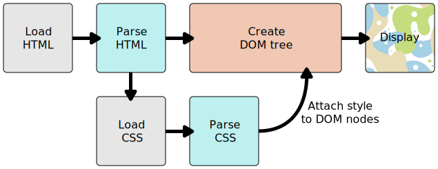

## 层叠样式表/CSS: Cascading Style Sheets

描述 HTML 或 XML（包括如 SVG、MathML、XHTML 之类的 XML 分支语言）文档的呈现。

### Overview

- 语法/Syntax
- 选择器/Selectors
- 设计/Architecture
- 糟糕做法/Bad Practices
- 实践/Best Practices

### Content

浏览器默认样式、外链样式、内联样式、行内样式



#### Syntax


#### Selectors

- 基本选择器
  + 元素选择器/Type selector `element`
  + 类选择器/Class selector `.class`
  + ID 选择器/ID selector `#id`
  + 通配选择器/Universal selector `*`, `ns|*`, `*|*`
  + 属性选择器/Attribute selector `[attr]`, `[attr=value]`, `[attr~=value]`, `[attr|=value]`, `[attr^=value]`, `[attr$=value]`, `[attr*=value]`

- 组合选择器
    - 相邻兄弟选择器/Adjacent sibling combinator `A + B`, `former_element + target_element { style properties }`
    - 普通兄弟选择器/General sibling combinator `A ~ B`, `former_element ~ target_element { style properties }`
    - 子选择器/Child combinator `A > B`
    - 后代选择器/Descendant combinator `A B`

- [伪类/Pseudo-classes](https://developer.mozilla.org/zh-CN/docs/Web/CSS/Pseudo-classes)
    - CSS Pseudo-classes: `:link`, `:visited`, `:hover`, `:active`, `:focus`, `:first-child`, `:last-child`, `:not(selector)`, `:nth-child(n)`, `:nth-of-type(n)`, `:nth-last-child(n)`, `:nth-last-of-type(n)`, `:only-child`, `:only-of-type`, `:lang(language)` ...
- [伪元素/Pseudo-elements](https://developer.mozilla.org/zh-CN/docs/Web/CSS/Pseudo-elements)
    - CSS Pseudo-elements: `::after`, `::before`, `::first-letter`, `::first-line`, `::placeholder`, `::selection` ...


- [Specifics on CSS Specificity | CSS-Tricks](https://css-tricks.com/specifics-on-css-specificity/)

#### Architecture

- 可用性, 可靠性/Usability, Reliability，能用，稳健
- 一致性/Consistency，能兼容
- 实用性/Availability，易于实现，易于理解，不依赖 Hack
- 可预测性/Predictability，能预测在更新、添加规则后受影响的范围
- 可维护性/Maintainability, Extensibility，各组件和功能耦合低，不被其它规则破坏，可改，可加
- 弹性/Scalability，能根据 Web 应用的规模和复杂性，能删，能增
- 可移植性/Portability，Atomicity，抽象分离，可重复使用
- 无障碍/Accessibility，照顾特殊群体

意思就是，当我们架构 CSS 时候，要采用 [Bootstrap](https://getbootstrap.com/) 那样的设计理念。

#### Bad Practices

- 基于父元素来修改组件
- 过于复杂的选择器，级联臃肿
- 过于通用的类名称
- 一个规则做太多事情
- 多个规则做相同事情
- 命名**具体表象**，颜色/尺寸/方位/形状，`.blue`, `.f14`, `.m10`, `.p10`, `.right`, `.dashed`
- 使用 `id` 选择器
- 使用 `!important`
- 固定尺寸

```css bad
.sidebar h3 {
  font-family: Arial, Helvetica, sans-serif;
  font-size: .8em;
  line-height: 1;
  color: #777;
  text-shadow: rgba(0, 0, 0, .3) 3px 3px 6px;
}

.footer h3 {
  font-family: Arial, Helvetica, sans-serif;
  font-size: 2em;
  line-height: 1;
  color: #777;
  text-shadow: rgba(0, 0, 0, .3) 3px 3px 6px;
}
```

```css good
.title {
  font-family: Arial, Helvetica, sans-serif;
  font-size: 2em;
  line-height: 1;
  color: #777;
  text-shadow: rgba(0, 0, 0, .3) 3px 3px 6px;
}

.footer .title {
  font-size: 1.5em;
  text-shadow: rgba(0, 0, 0, .3) 2px 2px 4px;
}
```

#### Best Practices

- 减少与 HTML 的耦合度
- 目的明确不误操作其它元素
- 分离关注点(HTML, CSS)，组合使用 [OOCSS](https://github.com/stubbornella/oocss/wiki) 和 [BEM](http://getbem.com/naming/)：
  + Structure, Skin
  + Container, Content
  + Base(Reset, Normalize), Layout, Module, State, Theme
- 采用兼容语言扩展 CSS preprocessor

### Additional Resources

- [《CSS揭秘》](https://item.jd.com/11911279.html)，推荐啃书📚
- [CSS教程 - 入门教程、选择器、取值与单位-长度](https://www.html.cn/book/css/)
- [CSS3教程](https://www.html.cn/doc/css3/)

### Up Next

- [BEM 参考：weui](https://github.com/Tencent/weui)
- [CSS（层叠样式表） | MDN](https://developer.mozilla.org/zh-CN/docs/Web/CSS)
- [CSS current work & how to participate - W3C](https://www.w3.org/Style/CSS/current-work)
- [W3Help - 兼容性 - 根本原因 - CSS相关、混合类型(RX1001/RX8018)](http://www.w3help.org/zh-cn/causes/)
- [CSS教程 - CSS HACK、问题与经验](https://www.html.cn/book/css/)

### Questions?

1. 在上一次的结构上布局一个文章页面：头部导航项是'index', 'feedback'，左侧是固定的文章大纲导航，右侧内容，底部版权；
